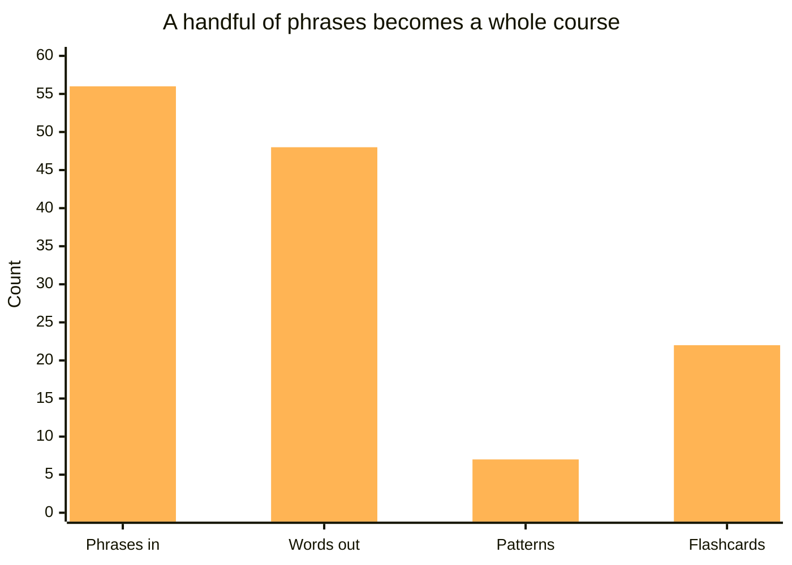
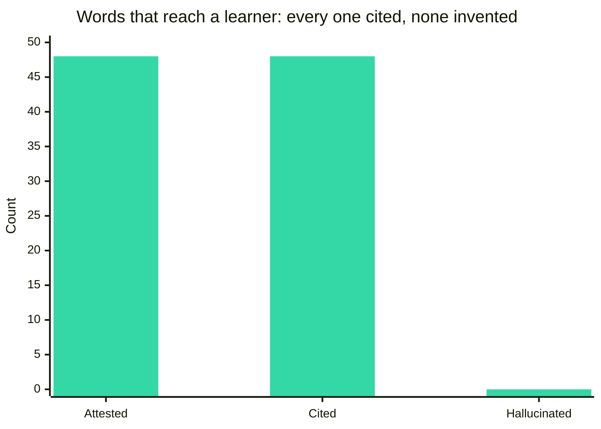
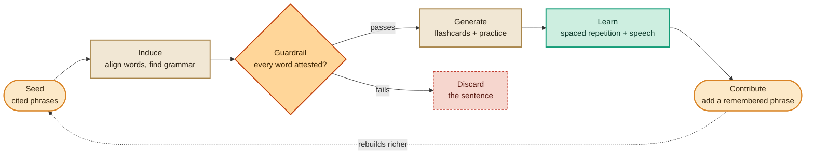
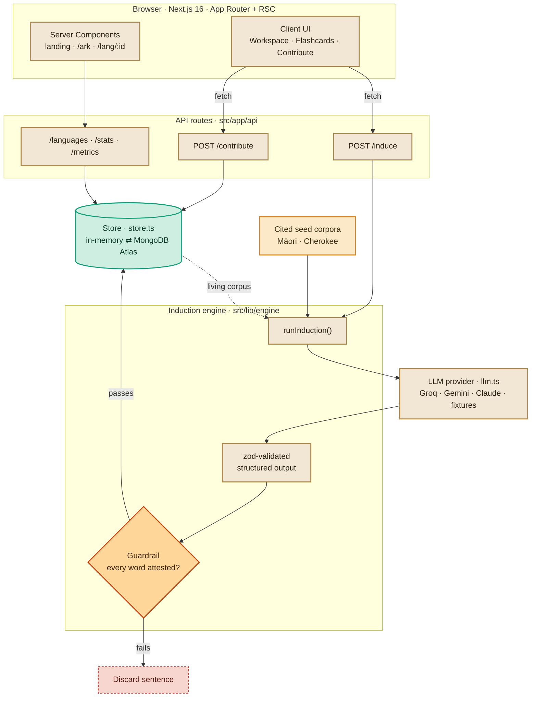

<div align="center">

# Lantern

### Duolingo for languages that are dying.

Lantern turns the few words a grandmother still remembers into a real course to learn her language, with an engine that discovers the grammar from those words and **never invents one**. Hand it the scraps an elder can still recall, and it gives back flashcards, pronunciation, and a spaced-repetition course, teaching only words real speakers actually said.

[**lantern-cyan.vercel.app**](https://lantern-cyan.vercel.app) &nbsp;·&nbsp; [The film](video/) &nbsp;·&nbsp; [The Moonshot paper](docs/MOONSHOT_PAPER.md)

[](https://nextjs.org)
[](https://www.typescriptlang.org)
[](https://tailwindcss.com)
[](docs/EVALUATION.md)
[](LICENSE)
&nbsp;
[](https://vercel.com/new/clone?repository-url=https%3A%2F%2Fgithub.com%2Fareebhirani-beep%2Flantern&env=GROQ_API_KEY,GEMINI_API_KEY,MONGODB_URI&envDescription=Optional.%20A%20free%20Groq%20or%20Gemini%20key%20turns%20on%20live%20induction.)

<br/>


</div>

## What it does

Pick a language so endangered that no app, no textbook, and no online course exists for it. Lantern takes a handful of remembered phrases, works out the grammar hidden inside them, and builds a real learning course: flashcards, pronunciation, and spaced repetition. Then it grows: every phrase someone adds rebuilds the course, richer. The one rule it never breaks is that it only teaches words real speakers actually said.

## Why it's different

A generic LLM tutor is a fluent guesser. For a language with thousands of hours of text that is often fine. For a language with fifty speakers left and almost nothing written down, a confident guess is the most dangerous thing you can hand a learner. Lantern is built the other way around: the model proposes, and code disposes.

| Dimension | Generic LLM tutor | Lantern |
|---|---|---|
| Invents words | Yes; will hallucinate plausible-looking forms | Never; a code-level guardrail discards any unattested word ([`guardrail.ts`](src/lib/engine/guardrail.ts)) |
| Citations | None; the output is simply asserted | 48/48; every vocabulary item is cited to a real corpus phrase |
| Works for a 10-speaker language | No usable training data, so it fabricates | Reasons only over the seed corpus it is handed (Ainu has ~10 native speakers) |
| Source of truth | The model's own output | The attested community corpus in [`src/lib/seed/`](src/lib/seed) |
| Fail mode | Confident fabrication, presented as fact | Discards the sentence; nothing unverified ever reaches a learner |

Every claim in that table is backed by the running app and the source: see [Live proof](#live-proof) and [The guardrail, explained](#the-guardrail-explained).

## By the numbers

Every figure below is computed live by the running app at [`/api/metrics`](src/app/api/metrics/route.ts), so it is reproducible rather than asserted ([method](docs/EVALUATION.md)):

| Phrases in | Words out | Grammar patterns | Flashcards | Hallucinated words | Vocabulary cited |
|:---:|:---:|:---:|:---:|:---:|:---:|
| 56 | 48 | 7 | 22 | **0** | **48 / 48** |



The guardrail is the part that matters: of every word Lantern teaches, **100% is cited to a real source and 0% is invented**.



Per language, from the two cited seed corpora that ship with the app:

| Language | Phrases in | Words | Patterns | Cards | Practice | Failing attestation | Cited |
|---|:---:|:---:|:---:|:---:|:---:|:---:|:---:|
| Māori (te reo Māori) | 41 | 34 | 5 | 12 | 5 | 0 | 34 / 34 |
| Cherokee (Tsalagi) | 15 | 14 | 2 | 10 | 2 | 0 | 14 / 14 |

**Zero hallucinated words reach a learner, and every vocabulary item is cited.** This is not a prompt instruction. It is enforced in code: every generated sentence is tokenized and checked against the attested vocabulary, and any sentence with an unattested word is discarded ([`src/lib/engine/index.ts`](src/lib/engine/index.ts)).

### Live proof

The `/api/metrics` route does not trust a self-report. It **independently recomputes** the attestation property using the engine's own `tokenize`, then counts violations. Fetch it yourself:

```bash
curl -s https://lantern-cyan.vercel.app/api/metrics
```

Live response, fetched 2026-06-27 (`summary` block):

| Field | Value |
|---|:---:|
| `inducibleLanguages` | 2 |
| `phrasesIn` | 56 |
| `vocabOut` | 48 |
| `patternsOut` | 7 |
| `cards` | 22 |
| `practice` | 7 |
| `practiceSentencesChecked` | 7 |
| `hallucinatedWordsThatReachedALearner` | **0** |
| `vocabCitationCoverage` | **"48/48"** |

The proof band that summarizes it:

```
0 invented   ·   48/48 cited   ·   7/7 attested
```

It maps directly to the response: `hallucinatedWordsThatReachedALearner = 0`, `vocabCitationCoverage = 48/48`, and `practiceSentencesChecked = 7` with `practiceFailingAttestation = 0` (so 7 of 7 practice sentences are fully attested).

Endpoint: **https://lantern-cyan.vercel.app/api/metrics**

## See it

<table>
<tr>
<td width="50%" valign="top">

**The engine's findings**

The grammar Lantern induced for Māori: tense particles, article-marked number, possessive classes, each discovered from the seed phrases alone.

</td>
<td width="50%" valign="top">

**A course you can take**

Your first words of te reo Māori as flashcards on an SM‑2 spaced-repetition schedule, with in-browser pronunciation.

</td>
</tr>
<tr>
<td><a href="https://lantern-cyan.vercel.app/lang/mi"></a></td>
<td><a href="https://lantern-cyan.vercel.app/lang/mi"></a></td>
</tr>
</table>

**The Living Ark:** eight endangered languages, with the live corpus counted in real time.

[](https://lantern-cyan.vercel.app/ark)

### See it learn, live


## How it works



The guardrail (the diamond) is the heart of it: a probabilistic model is handed a hard, code-level correctness property, that no unattested word ever reaches a learner.

| Step | What happens |
|---|---|
| 1. Seed | A speaker contributes a few phrases with meanings. Twenty is enough. |
| 2. Induce | The model aligns words to meanings, induces grammar from minimal pairs (for example, how Māori marks past, present, and future), and builds a cited vocabulary bank. |
| 3. Learn | A beginner course materializes: flashcards on an SM-2 spaced-repetition schedule, with text-to-speech. |
| 4. Grow | Every contribution rebuilds the course, richer. The language's record compounds instead of fading. |

> **It never makes up a word.** An AI cannot truly know a language with fifty speakers left, because there is almost nothing to learn it from. So Lantern reasons only over the phrases it is given, cites its evidence for every word, and runs a code-level guardrail before any lesson reaches a learner.

### The pipeline, in ASCII

The whole engine is one spine. Read it left to right:

```
   corpus            tokenize           induce            CITE-OR-REJECT          lesson
+-----------+     +-----------+     +------------+     +------------------+     +------------+
|  cited    |     | normalize |     | LLM        |     | guardrail:       |     | flashcards |
|  seed     | --> | + case-   | --> | proposes   | --> | every token      | --> | + practice |
|  phrases  |     |   fold,   |     | vocab,     |     | attested?        |     | + SM-2     |
| = ground  |     | drop gap  |     | grammar,   |     |   yes -> keep    |     | + TTS      |
|  truth    |     |  markers  |     | a course   |     |   no  -> discard |     |            |
+-----------+     +-----------+     +------------+     +--------+---------+     +------------+
      ^                                                         | no
      |                                                         v
      |   contribute a remembered phrase                  +-----------+
      |   (the flywheel: re-induce, richer)               | discarded |
      +--------------------------------------------------<| never     |
                                                          | shipped   |
                                                          +-----------+
```

`corpus -> tokenize -> induce -> CITE-OR-REJECT -> lesson`. The model only ever touches the `induce` box. Everything before it is data, and everything after the `CITE-OR-REJECT` gate is something a learner can trust.

## The guardrail, explained

The invariant, stated once and enforced in code:

> **No word reaches a learner unless every one of its tokens is attested by the community corpus, where *attested* means the token appears in a corpus phrase, or in a vocab form that was independently verified against its own citations.**

It lives in [`src/lib/engine/guardrail.ts`](src/lib/engine/guardrail.ts), which is deliberately dependency-free: it calls no model and no database, so it can be reasoned about and tested on its own.

| Function | `guardrail.ts` | What it enforces |
|---|:---:|---|
| `normalizeToken(t)` | L12-16 | Strips punctuation, trims, lowercases. Case-folds so a sentence-initial "Kia" matches the vocab form "kia"; macrons and syllabary fold correctly. |
| `tokenize(s)` | L22-27 | Splits on whitespace, normalizes, drops empty tokens and discontinuous-morpheme gap markers (the ellipsis and dash notation, not words). |
| `buildCorpusTokens(phrases)` | L30-34 | The set of every token that actually appears in the corpus: the only ground truth. |
| `isVocabVerified(form, evidence, byId)` | L41-54 | A vocab form is verified only if *every* one of its tokens occurs in one of its OWN cited evidence phrases. Catches both invented forms and miscitations. |
| `isFullyAttested(target, attested)` | L57-60 | A generated string survives only if it is non-empty and every token in it is attested. |

The gap markers it ignores are a real source constant (notation like Māori "e ... ana", never treated as words):

```ts
const GAP_TOKENS = new Set(["…", "...", "—", "-"]);
```

In [`src/lib/engine/index.ts`](src/lib/engine/index.ts), `assemble()` then builds the attested basis from the corpus tokens PLUS only the *verified* vocab form tokens (an unverified form never becomes ground truth), and **drops** every practice sentence and every flashcard answer that is not fully attested. So an invented word cannot launder itself into a lesson by hiding inside a sentence.

### Run the self-check

```bash
npx tsx src/lib/engine/guardrail.check.ts
```

It runs `node:assert/strict` with no test framework and prints exactly:

```
guardrail.check: all assertions passed
```

Among its assertions is the "taniwha attack": it confirms that an invented vocab item (`isVocabVerified("taniwha", ["mi-001"])`) stays **unverified**, and that a sentence laundering that invented word (`isFullyAttested("kia taniwha", attested)`) is **rejected**.

The full guardrail deep-dive (the exact invariant, why citation coverage must be 100%, the flashcard attestation gate, and the worked "taniwha" rejection) is in [docs/GUARDRAIL.md](docs/GUARDRAIL.md). Deeper method and reproducible metrics live in [docs/EVALUATION.md](docs/EVALUATION.md), and the architecture deep-dive is in [docs/ARCHITECTURE.md](docs/ARCHITECTURE.md).

## Architecture

Lantern is a single Next.js application: the marketing pages, the learning workspace, and the induction API all live in one deployable tree. Its core is the **induction engine**: the model only ever *proposes* vocabulary, grammar, and a course, and code *disposes*. Every reply is parsed into a strict schema, and a hard, in-code guardrail drops any lesson sentence containing a word the corpus does not attest, so a probabilistic model is never trusted on its own.



### Tech stack

| Layer | Choice | Why |
|---|---|---|
| Framework | Next.js 16 (App Router, React Server Components) | One deployable app: server-rendered pages and the induction API share a single tree. |
| Language | TypeScript 5, Tailwind v4 | `types.ts` is the single source of truth, shared by engine, store, and UI. |
| Reasoning | Provider-agnostic LLM layer ([`llm.ts`](src/lib/llm.ts)): Groq, Gemini, Anthropic, any OpenAI-compatible endpoint, plus verified fixtures | Swap keys without touching the engine. Groq is the free, no-card default; with no key it falls back to fixtures. |
| Validation | `zod` schema + in-code attestation guardrail ([`engine/index.ts`](src/lib/engine/index.ts), [`engine/guardrail.ts`](src/lib/engine/guardrail.ts)) | The model proposes; code validates the shape and rejects any unattested word. |
| Auth | Auth.js v5 (`next-auth ^5.0.0-beta.31`), JWT sessions | Credentials are always registered; Google and GitHub register only when keyed. An empty `.env` still boots the whole app. |
| Password hashing | bcryptjs, 10 rounds ([`users.ts`](src/lib/users.ts)) | Hashes credentials passwords in the Firestore user store. |
| User store | Firestore via `firebase-admin` ([`firebase-admin.ts`](src/lib/firebase-admin.ts)) | A `"users"` collection; every function no-ops or throws a clear message when Firestore is unconfigured. |
| Living corpus | MongoDB Atlas (optional), in-memory fallback ([`store.ts`](src/lib/store.ts)) | Zero-config by default; persists the moment a `MONGODB_URI` is set; fail-soft on connect error. |
| Audio storage | Vercel Blob (`@vercel/blob`) ([`storage.ts`](src/lib/storage.ts)) | 5MB cap, MIME allowlist; `BLOB_READ_WRITE_TOKEN` is auto-injected by the Vercel Blob integration. |
| Spaced repetition | SM-2 ([`srs.ts`](src/lib/srs.ts)) | Standard, well-understood scheduling for the flashcard course. |
| Pronunciation | Web Speech API ([`tts.ts`](src/lib/tts.ts)) | No audio assets to ship; speech is synthesized in the browser. |
| Styling | Tailwind v4, Framer Motion | Cinematic dark, ember-on-near-black; one accent, restrained motion. |

### Request lifecycle: inducing a course

1. The client calls **`POST /api/induce`** with a `languageId`.
2. The route resolves the active **store** and returns a cached induction if one exists (`force: true` skips the cache and re-runs).
3. Otherwise it loads the language's cited phrases and hands them to **`runInduction()`**.
4. For the two verified seed languages the engine pins to a hand-checked **fixture** while the corpus is still at its seed size, so the demo never breaks even with no API key; the first contribution grows the corpus past the seed and the live engine takes over. Any provider-keyed run calls the active **LLM provider**.
5. The model's reply is parsed into a strict **`zod`** schema, and anything malformed is rejected outright.
6. Every generated practice sentence and every flashcard answer is tokenized and matched against the attested vocabulary; **anything containing an unattested word is discarded** before it is ever saved.
7. The validated, guardrailed induction is persisted and returned to the UI, which renders the grammar, the cited vocabulary, and a playable course.

Runs with zero configuration. With no key and no database it serves verified, hand-checked induction so the demo never breaks. Add a key and the engine runs live; add a database and the corpus persists.

## Project structure

Annotated against the real tree:

```
src/
  app/
    page.tsx               landing
    ark/page.tsx           the Living Ark (all 8 languages, live counts)
    lang/[id]/page.tsx     per-language workspace + course (loading.tsx alongside)
    faq/ privacy/ terms/   marketing pages
    signin/ reset/         auth pages
    api/
      induce/              POST: run or return an induction for a language
      contribute/          POST: add a remembered phrase (invalidates cache -> re-induce)
      languages/           GET registry + per-language reads (languages/[id])
      stats/               GET live Ark stats
      metrics/             GET: independently RECOMPUTES the attestation proof
      audio/               POST multipart: speaker audio -> Vercel Blob
      auth/[...nextauth]   Auth.js handlers, plus register / request-reset / reset / verify-email
  lib/
    engine/
      index.ts             runInduction(): call model, zod-validate, enforce the guardrail
      guardrail.ts         dependency-free invariant: tokenize, isVocabVerified, isFullyAttested
      guardrail.check.ts   node:assert self-check (incl. the taniwha laundering attack)
      prompts.ts           the induction system + user prompts
      fixtures.ts          verified cached induction (offline + demo safety net)
    llm.ts                 provider-agnostic LLM: Groq / Gemini / Anthropic / OpenAI-compatible
    anthropic.ts           Anthropic tool-use call helper
    store.ts               Store interface: InMemoryStore (default) <-> MongoStore (Atlas)
    storage.ts             Vercel Blob upload, server-only (5MB cap, MIME allowlist)
    users.ts               Firestore user store (bcryptjs, 10 rounds)
    auth-config.ts         Auth.js v5 provider + callback config
    auth-tokens.ts email.ts   verify-email and password-reset plumbing
    firebase-admin.ts      Firestore admin init (isFirebaseConfigured)
    seed/                  cited seed corpora: maori.ts, cherokee.ts, index.ts (SEED_PHRASES)
    languages.ts           the Ark registry (8 languages; INDUCIBLE = mi, chr)
    srs.ts                 SM-2 spaced repetition
    tts.ts                 Web Speech pronunciation
    types.ts               the domain model, shared by engine, store, and UI
  auth.ts                  Auth.js v5 entry (handlers, signIn, signOut, auth)
  components/              Workspace, InductionView, Flashcards, ContributeForm,
                           PronunciationInput, AccountMenu, AuthForm, Nav, Footer, ...
scripts/                   failsoft / mongo / blob / firestore round-trip checks
docs/                      EVALUATION.md, MOONSHOT_PAPER.md, screenshots/, submissions/
```

## Scripts and checks

None of these are `npm` scripts; they run directly with `npx tsx`. The four that touch a service read `.env.local` with `--env-file`.

| Check | Command | What it proves |
|---|---|---|
| guardrail | `npx tsx src/lib/engine/guardrail.check.ts` | The no-hallucination guardrail holds: tokenize/normalize, `isVocabVerified`, `isFullyAttested`, and the taniwha laundering attack. Prints `guardrail.check: all assertions passed`. |
| fail-soft | `npx tsx scripts/failsoft.check.ts` | PHASE 0 fail-soft: with an invalid `GROQ_API_KEY` and a corpus grown one phrase past the seed, `runInduction` returns the fixture (`source: "fixture"`) instead of throwing, so Contribute never errors for mi/chr. |
| MongoDB | `npx tsx --env-file=.env.local scripts/mongo.check.ts` | A MongoDB Atlas round-trip: connect, ping, insert, read, delete. |
| Vercel Blob | `npx tsx --env-file=.env.local scripts/blob.check.ts` | A Vercel Blob round-trip: put, public fetch, delete. |
| Firestore | `npx tsx --env-file=.env.local scripts/firestore.check.ts` | A Firestore user-store round-trip (write, read, delete), the same store that backs auth. |

The `npm` scripts in `package.json` are the standard four: `dev` (`next dev`), `build` (`next build`), `start` (`next start`), `lint` (`eslint`).

## Quickstart

```bash
git clone https://github.com/areebhirani-beep/lantern
cd lantern
npm install
npm run dev          # http://localhost:3000, works immediately, zero config
```

That is the whole setup. With no keys and no database, the app boots and serves verified, hand-checked induction for Māori and Cherokee, so the demo always works.

### `.env.local` keys

To run the engine live or persist the corpus, copy `.env.example` to `.env.local` and fill in what you want. **Every key below is optional**; with none of them, Lantern falls back to verified fixtures.

| Key | What it unlocks | Notes |
|---|---|---|
| `GROQ_API_KEY` | Live induction (the free default provider) | No credit card. Create one at [console.groq.com/keys](https://console.groq.com/keys). Auto-detected. |
| `GEMINI_API_KEY` (+ `GEMINI_MODEL`) | Live induction via Google Gemini | Also free, [aistudio.google.com/apikey](https://aistudio.google.com/apikey). Default model `gemini-2.0-flash`. |
| `ANTHROPIC_API_KEY` (+ `ANTHROPIC_MODEL`) | Live induction via Anthropic Claude | Requires API credits; deepest induction. Default model `claude-opus-4-8`. |
| `OPENAI_API_KEY` (+ `OPENAI_BASE_URL`, `OPENAI_MODEL`) | Live induction via any OpenAI-compatible endpoint | OpenRouter, Cerebras, Together, GitHub Models, or OpenAI itself. The same slot drives Groq. |
| `MONGODB_URI` (+ `MONGODB_DB`) | Persists the living corpus, induced vocab, lessons, and contributions | Without it, an in-memory store seeded from the bundled corpora. `MONGODB_DB` defaults to `lantern`. Fail-soft: a bad connection logs and falls back to in-memory. |
| `AUTH_SECRET` | Enables accounts (Auth.js v5 hard-requires this one var) | Generate with `npx auth secret`. Without it, no auth UI renders and no failing session calls fire. |
| `AUTH_URL` | The auth callback base URL | `http://localhost:3000` in dev; the production URL in prod. |
| `GOOGLE_CLIENT_ID` / `GOOGLE_CLIENT_SECRET` | Google sign-in | Registers only when both are set. Callback `/api/auth/callback/google`. |
| `GITHUB_ID` / `GITHUB_SECRET` | GitHub sign-in | Registers only when both are set. Callback `/api/auth/callback/github`. |
| `FIREBASE_PROJECT_ID` / `FIREBASE_CLIENT_EMAIL` / `FIREBASE_PRIVATE_KEY` | The Firestore user store (accounts, password hashes) | Keep the `\n` escapes in the private key and wrap the whole value in double quotes. |
| `BLOB_READ_WRITE_TOKEN` | Speaker audio uploads (Vercel Blob) | Auto-injected by the Vercel Blob integration, so it is **not** listed in `.env.example`. |

> Note: `.env.example` also lists `AWS_REGION`, `AWS_ACCESS_KEY_ID`, `AWS_SECRET_ACCESS_KEY`, and `S3_BUCKET` for audio, but no code reads them. Audio uploads use **Vercel Blob** today; the S3 path is not yet wired (see [Roadmap](#roadmap)).

```bash
GROQ_API_KEY=...                  # FREE, no credit card, from console.groq.com/keys
# or GEMINI_API_KEY=...           # also free, from aistudio.google.com/apikey
MONGODB_URI=mongodb+srv://...     # optional, persists the living corpus
```

## The languages aboard

| Language | Status | Speakers | Region | Inducible |
|---|---|---|---|:---:|
| Māori | Vulnerable | ~50,000 fluent | Aotearoa New Zealand | ✅ |
| Cherokee | Critically endangered | ~1,500–2,000 | Oklahoma and North Carolina | ✅ |
| Hawaiian | Critically endangered | ~24,000 | Hawaiʻi | |
| Ainu | Critically endangered | ~10 native | Hokkaidō, Japan | |
| Manx | Severely endangered | revived from its last speaker | Isle of Man | |
| Cornish | Severely endangered | revived from dormant | Cornwall | |
| Navajo | Vulnerable | ~150,000 | Southwestern USA | |
| Yiddish | Definitely endangered | diaspora | worldwide | |

Only the two checked languages ship as fully inducible today (`INDUCIBLE_LANGUAGE_IDS = ["mi", "chr"]` in [`languages.ts`](src/lib/languages.ts)). The other six are registry-only until they receive cited seed corpora; see [Roadmap](#roadmap).

## Deploy

One click with the button above, or import this repo into [Vercel](https://vercel.com/new). It is a standard Next.js app at the repository root. Set `GROQ_API_KEY` (free, no card, from [console.groq.com](https://console.groq.com/keys)) in the Vercel dashboard to enable live induction.

## Roadmap

Everything here is **not yet built**. It is listed honestly so the README never implies more than the code does.

| Item | Status |
|---|---|
| PHASE 3 persistence | Roadmap: the living corpus fully persisted and community-governed end to end. MongoDB persistence already works when `MONGODB_URI` is set; this phase hardens and extends it. |
| More languages | Roadmap: only mi and chr are inducible today. The other six (haw, ain, gv, kw, nv, yi) are registry-only until each gets a cited, verified seed corpus. |
| Audio via AWS S3 | Roadmap: `.env.example` lists `AWS_REGION` / `AWS_ACCESS_KEY_ID` / `AWS_SECRET_ACCESS_KEY` / `S3_BUCKET`, but no code reads them. Audio currently uses Vercel Blob; the S3 path is not yet wired. |

## Documentation

- [The Guardrail](docs/GUARDRAIL.md): the differentiator, the exact invariant, the flashcard attestation gate, and the worked "taniwha" rejection.
- [Architecture](docs/ARCHITECTURE.md): request lifecycle, the induction engine, fail-soft layers, the data model, and the auth flow.
- [Evaluation](docs/EVALUATION.md): reproducible metrics and the no-hallucination check.
- [Contributing](CONTRIBUTING.md): dev setup, the invariants you must not break, and how to verify before "done".
- [Security](SECURITY.md): input bounds on `/api/audio`, secret hygiene, and no PII in URLs.
- [The Moonshot Paper](docs/MOONSHOT_PAPER.md): the full blueprint and long-term vision.
- The film: an 86-second story in 4K at 60fps, built in Remotion, in [`video/`](video/).

## License

[MIT](LICENSE).

### Community data sovereignty

Endangered-language data carries real ownership concerns. The communities own and govern their corpus; Lantern is a tool they wield on their own data, not an extraction pipeline. Seed phrases are cited from public, reputable sources (Te Aka Māori Dictionary, university te reo resources, DAILP and Cherokee Nation, Omniglot). Macrons and syllabary are verified, and pronunciation is presented honestly as an approximate guide. The guardrail exists for the same reason: a community's language should never be paraphrased, padded, or invented to look more complete than the record its speakers actually attest.

---

**Verified by:** `GET https://lantern-cyan.vercel.app/api/metrics` · `npx tsx src/lib/engine/guardrail.check.ts` · `npm run build`
</content>
</invoke>
