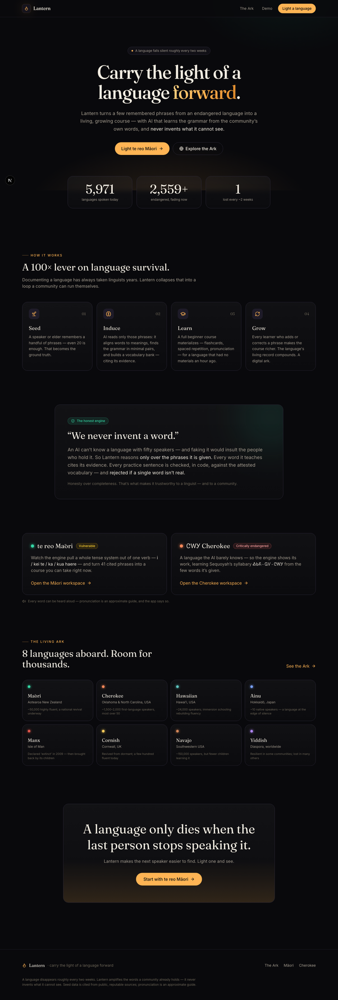
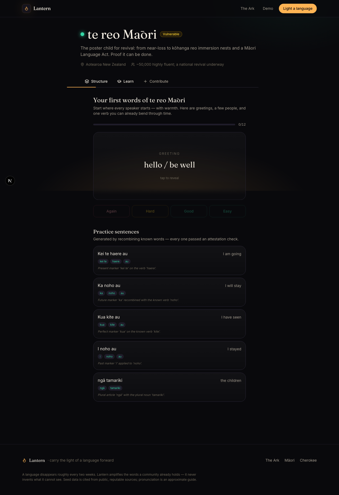
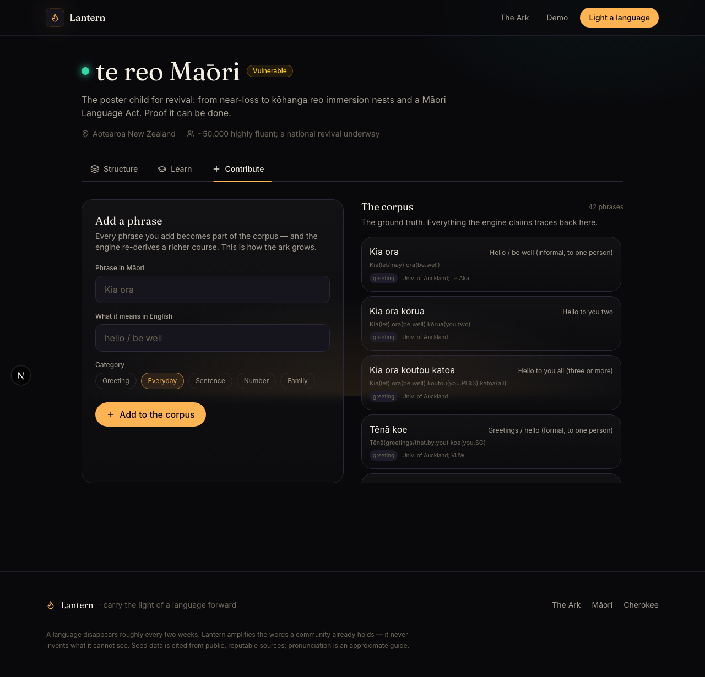
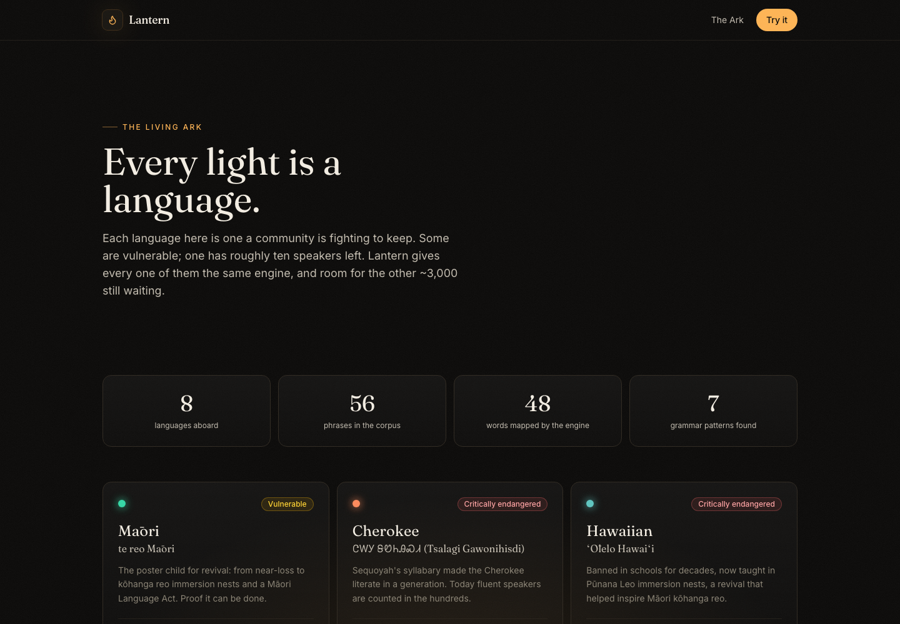

<div align="center">

# 🏮 Lantern

### Carry the light of a language forward.

**A language falls silent roughly every two weeks.** Lantern turns a handful of remembered phrases from an endangered language into a living, growing course — with AI that learns the grammar from the community's own words, and **never invents what it cannot see.**

<br/>



</div>

---

## The problem

There are ~7,000 languages alive today. Around **3,000 are endangered**, and one disappears about every two weeks. When the last speaker goes, a thousand years of grammar, story, and song go with them.

The bottleneck has never been desire. It's **cost.** Documenting a language and building teaching materials traditionally takes trained linguists *years*. Most endangered languages will never get that attention in time.

## The insight

AI can collapse that cost by ~100× — **but only if it's honest.**

A model cannot *know* a language with fifty speakers; there's no training data, and pretending otherwise would insult the people who hold it. So Lantern flips the usual approach. It does not generate a language from the void. It **amplifies the words a community already remembers**, turning a tiny seed corpus into a real course, and growing that corpus every time someone learns or corrects it.

Give a community a 100× lever. Don't replace the speaker — multiply them.

## The honest engine (the part that matters)

> **"We never invent a word."**

This is enforced, not promised:

1. **Evidence only.** The engine reasons *only* over the phrases it is given. Every vocabulary entry it teaches cites the corpus phrases that attest it.
2. **Controlled generation.** Practice sentences are built by recombining *known* words according to a *found* pattern — never by importing outside vocabulary.
3. **A code-level guardrail.** After generation, every practice sentence is tokenized and checked against the attested vocabulary. **If a single word isn't real, the sentence is dropped** — in code, before it ever reaches a learner. (`src/lib/engine/index.ts` → `isFullyAttested`.)

That's what makes Lantern trustworthy to a linguist *and* to a community.

---

## See it

| The workspace — structure the engine induced | Learn, with spaced repetition + audio |
|---|---|
|  |  |

| Contribute → the corpus grows → the course re-derives | The Living Ark |
|---|---|
|  |  |

---

## How it works

```
   Seed              Induce                 Learn                Grow
 ┌────────┐      ┌──────────────┐      ┌──────────────┐      ┌──────────────┐
 │ ~20–50 │ ───▶ │ align words, │ ───▶ │ flashcards,  │ ───▶ │ every learner│
 │ cited  │      │ find grammar,│      │ spaced rep., │      │ adds/fixes a │
 │ phrases│      │ build vocab  │      │ pronunciation│      │ phrase ──┐   │
 └────────┘      └──────────────┘      └──────────────┘      └──────────┼───┘
                         ▲                                              │
                         └──────────────────────────────────────────────┘
                          the corpus compounds — a self-growing digital ark
```

1. **Seed** — a speaker contributes a few phrases with meanings. Even 20 is enough.
2. **Induce** — the model aligns words to meanings (interlinear glossing), induces grammar from minimal pairs, and builds a cited vocabulary bank.
3. **Learn** — a beginner course materializes: flashcards on an SM-2 spaced-repetition schedule, with text-to-speech pronunciation.
4. **Grow** — every contribution invalidates the cached induction, so the next learner gets a richer course. The language's living record compounds.

---

## Architecture

| Layer | Choice | Why |
|---|---|---|
| Framework | **Next.js 16** (App Router, RSC, Turbopack) | One codebase, server + client, fast |
| Language | **TypeScript** end to end | A typed domain model is the contract |
| Reasoning | **Frontier LLM** — Gemini (free tier) or Claude — forced structured output + zod validation | Deep, citable linguistic induction |
| Persistence | **MongoDB Atlas** (optional) with an in-memory fallback | The living corpus + flywheel |
| Styling | **Tailwind v4**, Framer Motion | The Lantern design system |
| Pronunciation | **Web Speech API** | Free, in-browser, no key |

**Module map**

```
src/lib/
  types.ts            # the domain model — the contract between engine, store, UI
  languages.ts        # the Ark registry (8 languages, 2 fully inducible)
  seed/               # verified, CITED seed corpora (Māori, Cherokee)
  engine/
    prompts.ts        # the field-linguist system prompt + structured-output schema
    index.ts          # runInduction(): call Claude → validate → enforce guardrail
    fixtures.ts       # verified cached induction (offline + demo safety net)
  store.ts            # Store interface: in-memory or MongoDB Atlas
  srs.ts              # SM-2 spaced repetition (pure, client + server)
  tts.ts              # Web Speech API helper
src/app/api/          # induce · contribute · languages · stats  (Node route handlers)
src/app/              # /  ·  /ark  ·  /lang/[id]
```

**Resilience:** Lantern runs with **zero configuration** — no API key, no database. Without a key it serves verified, hand-checked induction fixtures so the experience never breaks; with a key, the engine runs live. Same for the database: in-memory by default, MongoDB Atlas when configured.

---

## Quickstart

```bash
npm install
npm run dev          # → http://localhost:3000  (works immediately, fixture mode)
```

To enable the **live** induction engine and persistent corpus, copy `.env.example` to `.env.local`:

```bash
GEMINI_API_KEY=...                # FREE at aistudio.google.com/apikey — turns on live induction
# or ANTHROPIC_API_KEY=sk-ant-... # Claude instead, if you have credits
MONGODB_URI=mongodb+srv://...     # turns on the persistent living corpus
MONGODB_DB=lantern
```

---

## The languages aboard

Māori (hero) and Cherokee ship with verified, cited corpora and are fully inducible. The rest populate the Ark — including **Ainu** (~10 speakers) and the **brought-back-from-dormant** Manx and Cornish, proof that revival is possible.

| | Language | Status | Why it's here |
|---|---|---|---|
| 🟢 | **te reo Māori** | Vulnerable | The revival success story — and a full tense system from one verb |
| 🟠 | **ᏣᎳᎩ Cherokee** | Critically endangered | A language the AI barely knows — so the engine shows its work |
| 🔵 | Hawaiian · Ainu · Manx · Cornish · Navajo · Yiddish | varies | The frontier, and the proof |

## Honesty & provenance

Seed phrases are cited from public, reputable sources (Te Aka Māori Dictionary, university te reo resources, DAILP / Cherokee Nation, Omniglot). Macrons and syllabary are verified. Pronunciation via the Web Speech API is an **approximate guide** — and the UI says so. Where evidence is thin, the engine lowers its confidence or stays silent. **Honesty over completeness.**

## Roadmap

- Speaker-recorded seed audio + community pronunciation review
- Morphological generation beyond recombination (once a corpus is large enough)
- Export to Anki / printable primers for offline communities
- Data-sovereignty controls: communities own and govern their corpus

See [`docs/MOONSHOT_PAPER.md`](docs/MOONSHOT_PAPER.md) for the full blueprint — the philosophy, the architecture, and the long-term vision.

---

<div align="center">

*A language only dies when the last person stops speaking it. Lantern makes the next speaker easier to find.*

</div>
