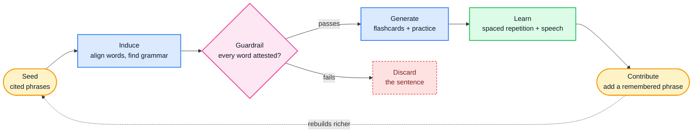
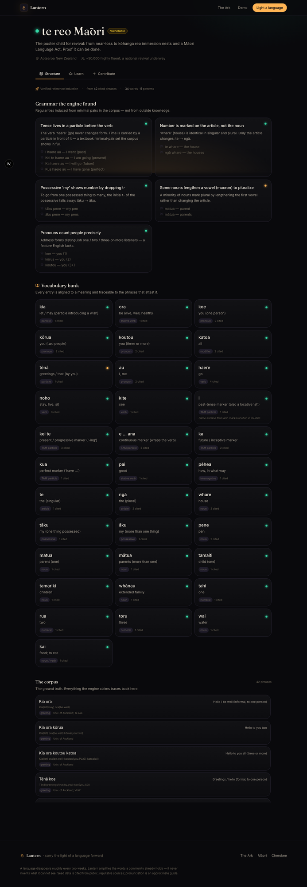
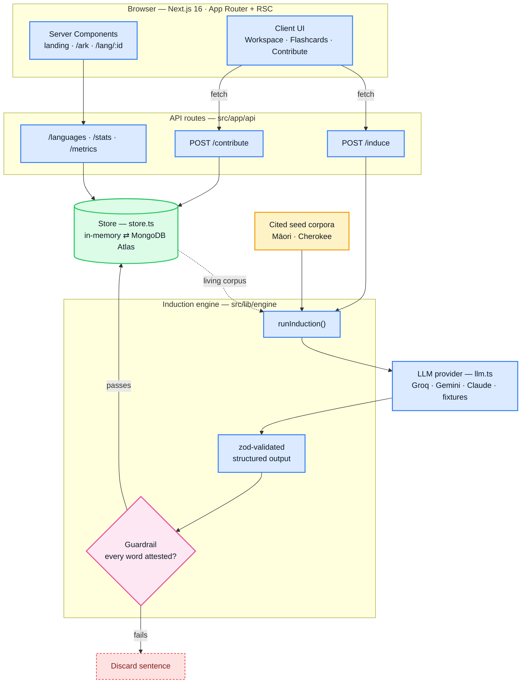

<div align="center">

# Lantern

**Duolingo for languages that are dying.**

Lantern turns the few words an elder still remembers into a real course to learn their language, with AI that learns the grammar from those words and never invents one.

[](https://nextjs.org)
[](https://www.typescriptlang.org)
[](https://tailwindcss.com)
[](LICENSE)
&nbsp;
[](https://vercel.com/new/clone?repository-url=https%3A%2F%2Fgithub.com%2Fareebhirani-beep%2Flantern&env=GROQ_API_KEY,GEMINI_API_KEY,MONGODB_URI&envDescription=Optional.%20A%20free%20Groq%20or%20Gemini%20key%20turns%20on%20live%20induction.)

</div>


## What it does

Pick a language so endangered that no app, no textbook, and no online course exists for it. Lantern takes a handful of remembered phrases, works out the grammar hidden inside them, and builds a real learning course: flashcards, pronunciation, and spaced repetition. Then it grows. Every phrase someone adds rebuilds the course, richer. The one rule it never breaks is that it only teaches words real speakers actually said.

## By the numbers

Computed live by the app at [`/api/metrics`](src/app/api/metrics/route.ts), so every figure is reproducible rather than asserted ([method](docs/EVALUATION.md)):

| Phrases in | Words out | Grammar patterns | Flashcards | Hallucinated words | Vocabulary cited |
|:---:|:---:|:---:|:---:|:---:|:---:|
| 56 | 48 | 7 | 22 | **0** | **48 / 48** |

Per language, from the two cited seed corpora that ship with the app:

| Language | Phrases in | Words | Patterns | Cards | Practice | Failing attestation | Cited |
|---|:---:|:---:|:---:|:---:|:---:|:---:|:---:|
| Māori (te reo Māori) | 41 | 34 | 5 | 12 | 5 | 0 | 34 / 34 |
| Cherokee (Tsalagi) | 15 | 14 | 2 | 10 | 2 | 0 | 14 / 14 |

**Zero hallucinated words reach a learner, and every vocabulary item is cited.** This is not a prompt instruction. It is enforced in code: every generated sentence is tokenized and checked against the attested vocabulary, and any sentence with an unattested word is discarded ([`src/lib/engine/index.ts`](src/lib/engine/index.ts)).

## How it works



The guardrail (the diamond) is the heart of it: a probabilistic model is given a hard, code-level correctness property, no unattested word ever reaches a learner.

| Step | What happens |
|---|---|
| 1. Seed | A speaker contributes a few phrases with meanings. Twenty is enough. |
| 2. Induce | The model aligns words to meanings, induces grammar from minimal pairs (for example, how Māori marks past, present, and future), and builds a cited vocabulary bank. |
| 3. Learn | A beginner course materializes: flashcards on an SM-2 spaced-repetition schedule, with text-to-speech. |
| 4. Grow | Every contribution rebuilds the course, richer. The language's record compounds instead of fading. |

> **It never makes up a word.** An AI cannot truly know a language with fifty speakers left, because there is almost nothing to learn it from. So Lantern reasons only over the phrases it is given, cites its evidence for every word, and runs a code-level guardrail before any lesson reaches a learner.

## The product



The workspace shows the words the community gave it, the grammar the engine found, a course you can take, and a Contribute tab where adding a phrase rebuilds the course live.

## Architecture

Lantern is a single Next.js application: the marketing pages, the learning workspace, and the induction API all live in one deployable tree. Its core is the **induction engine** — the model only ever *proposes* vocabulary, grammar, and a course, and code *disposes*. Every reply is parsed into a strict schema, and a hard, in-code guardrail drops any lesson sentence containing a word the corpus does not attest, so a probabilistic model is never trusted on its own.



| Layer | Choice | Why |
|---|---|---|
| Framework | Next.js 16 — App Router, React Server Components | One deployable app: server-rendered pages and the induction API share a single tree. |
| Language | TypeScript, end to end | The domain model in `types.ts` is the single source of truth, shared by engine, store, and UI. |
| Reasoning | Frontier LLM — Groq, Gemini free tier, or Claude — with forced structured output | Provider-agnostic (`llm.ts`); swap keys without touching the engine. |
| Validation | `zod` schema + in-code attestation guardrail | The model proposes; code validates the shape and rejects any unattested word. |
| Persistence | MongoDB Atlas (optional), in-memory fallback | Zero-config by default; the living corpus persists the moment a `MONGODB_URI` is set. |
| Spaced repetition | SM-2 (`srs.ts`) | Standard, well-understood scheduling for the flashcard course. |
| Styling | Tailwind v4, Framer Motion | |
| Pronunciation | Web Speech API (`tts.ts`) | No audio assets to ship; speech is synthesized in the browser. |

```
src/lib/
  types.ts            the domain model, shared by engine, store, and UI
  languages.ts        the Ark registry (8 languages, 2 fully inducible)
  seed/               verified, cited seed corpora (Māori, Cherokee)
  engine/index.ts     runInduction(): call the model, validate, enforce the guardrail
  engine/prompts.ts   the induction system + user prompts
  engine/fixtures.ts  verified cached induction (offline and demo safety net)
  llm.ts              provider-agnostic: Groq, Gemini, Claude, or fixtures
  store.ts            Store interface: in-memory or MongoDB Atlas
  srs.ts              SM-2 spaced repetition
  tts.ts              Web Speech pronunciation
src/app/api/          induce, contribute, languages, stats, metrics
src/app/              landing, /ark, /lang/[id]
src/components/       Workspace, InductionView, Flashcards, ContributeForm
```

### Request lifecycle: inducing a course

1. The client calls **`POST /api/induce`** with a `languageId`.
2. The route resolves the active **store** and returns a cached induction if one exists (`force: true` skips the cache and re-runs).
3. Otherwise it loads the language's cited phrases and hands them to **`runInduction()`**.
4. For the two verified seed languages the engine pins to a hand-checked **fixture**, so the demo never breaks even with no API key; any other language calls the active **LLM provider**.
5. The model's reply is parsed into a strict **`zod`** schema — anything malformed is rejected outright.
6. Every generated practice sentence is tokenized and matched against the attested vocabulary; **any sentence containing an unattested word is discarded** before it is ever saved.
7. The validated, guardrailed induction is persisted and returned to the UI, which renders the grammar, the cited vocabulary, and a playable course.

Runs with zero configuration. With no key and no database it serves verified, hand-checked induction so the demo never breaks. Add a key and the engine runs live; add a database and the corpus persists.

## The languages aboard

| Language | Status | Speakers | Region | Inducible |
|---|---|---|---|:---:|
| Māori | Vulnerable | ~50,000 fluent | Aotearoa New Zealand | yes |
| Cherokee | Critically endangered | ~1,500–2,000 | Oklahoma and North Carolina | yes |
| Hawaiian | Critically endangered | ~24,000 | Hawaiʻi | |
| Ainu | Critically endangered | ~10 native | Hokkaidō, Japan | |
| Manx | Severely endangered | revived from its last speaker | Isle of Man | |
| Cornish | Severely endangered | revived from dormant | Cornwall | |
| Navajo | Vulnerable | ~150,000 | Southwestern USA | |
| Yiddish | Definitely endangered | diaspora | worldwide | |

## Quickstart

```bash
git clone https://github.com/areebhirani-beep/lantern
cd lantern
npm install
npm run dev          # http://localhost:3000, works immediately
```

Optional, to run the engine live and persist the corpus (copy `.env.example` to `.env.local`):

```bash
GROQ_API_KEY=...                  # FREE, no credit card, from console.groq.com/keys
# or GEMINI_API_KEY=...           # also free, from aistudio.google.com/apikey
MONGODB_URI=mongodb+srv://...     # optional, persists the living corpus
```

## Deploy

One click with the button above, or import this repo into [Vercel](https://vercel.com/new). It is a standard Next.js app at the repository root. Set `GROQ_API_KEY` (free, no card, from [console.groq.com](https://console.groq.com/keys)) in the Vercel dashboard to enable live induction.

## Documentation

- [The Moonshot Paper](docs/MOONSHOT_PAPER.md), the full blueprint and long-term vision.
- [Evaluation](docs/EVALUATION.md), reproducible metrics and the no-hallucination check.
- The film, an 86-second story in 4K at 60fps, built in Remotion, in [`video/`](video/).

## Provenance and ethics

Seed phrases are cited from public, reputable sources (Te Aka Māori Dictionary, university te reo resources, DAILP and Cherokee Nation, Omniglot). Macrons and syllabary are verified. Pronunciation is presented honestly as an approximate guide. Endangered-language data carries real ownership concerns: communities own and govern their corpus, and Lantern is a tool they wield on their own data, not an extraction pipeline.

## License

[MIT](LICENSE).
